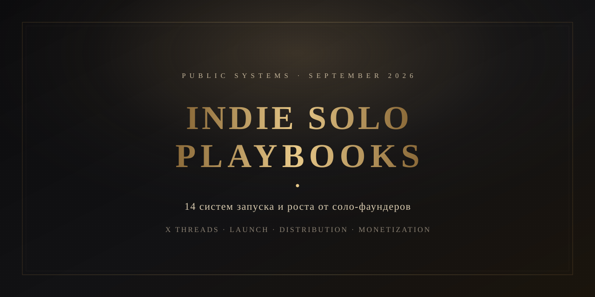

<p align="center">
  
</p>

<p align="center">
  <a href="../README.md">Русский</a> · English
</p>

<p align="center">
  
  
  
  
  
</p>

<p align="center"><strong>Not motivation.</strong> Public launch-and-growth systems from people who are still shipping in 2026 and writing down how they do it.</p>

---

## Why this repo exists

Two layers:

1. **Playbooks** — public notes from one founder: philosophy, launch, channels, mistakes, 30 days, sources.
2. **Skills** — short procedures for agents in the [Agent Skills](https://agentskills.io) format (`SKILL.md`). The agent does not load all 14 texts into every chat.

Selection: solo / almost solo, live products in 2025–2026, public numbers, a repeatable method — not a one-off spike.

Numbers inside are their public claims and screenshots, not an audit.

The Russian files remain the canonical source. This folder is a mirror.

---

## Playbooks

| # | Who | Handle | System |
| ---: | --- | --- | --- |
| 01 | [Jack Friks](playbooks/01-jack-friks.md) | [@jackfriks](https://x.com/jackfriks) | Audience first, warmup, launch as an event |
| 02 | [Marc Lou](playbooks/02-marc-lou.md) | [@marclou](https://x.com/marclou) | Ship or Die: portfolio, speed, one channel |
| 03 | [Pieter Levels](playbooks/03-pieter-levels.md) | [@levelsio](https://x.com/levelsio) | Ship dirty, live in public, ride the wave |
| 04 | [Tony Dinh](playbooks/04-tony-dinh.md) | [@tdinh_me](https://x.com/tdinh_me) | One product, one channel. X as the engine |
| 05 | [Danny Postma](playbooks/05-danny-postma.md) | [@dannypostma](https://x.com/dannypostma) | Paid + a product that shows itself |
| 06 | [Nico Jeannen](playbooks/06-nico-jeannen.md) | [@nico_jeannen](https://x.com/nico_jeannen) | Meta ads and creatives, not threads |
| 07 | [Tibo](playbooks/07-tibo.md) | [@tibo_maker](https://x.com/tibo_maker) | Portfolio and partnerships, not one hit |
| 08 | [Rob Hallam](playbooks/08-rob-hallam.md) | [@robj3d3](https://x.com/robj3d3) | Demand first, then code |
| 09 | [Alex Nguyen](playbooks/09-alex-nguyen.md) | [@alexcooldev](https://x.com/alexcooldev) | Short-video volume, profit in a week |
| 10 | [Yasser Elsaid](playbooks/10-yasser-elsaid.md) | [@yasser_elsaid_](https://x.com/yasser_elsaid_) | Public MRR as a channel and as trust |
| 11 | [Nevo David](playbooks/11-nevo-david.md) | [@wickedguro](https://x.com/wickedguro) | Sell the outcome, not another Buffer |
| 12 | [Dan Kulkov](playbooks/12-dan-kulkov.md) | [@DanKulkov](https://x.com/DanKulkov) | One audience, a simple offer, marketing off X |
| 13 | [Damon Chen](playbooks/13-damon-chen.md) | [@damonchen](https://x.com/damonchen) | Domain = query. X starts, Google scales |
| 14 | [Ilias Ism](playbooks/14-illyism.md) | [@illyism](https://x.com/illyism) | SEO catches demand. Sell by hand first |

Russian originals live in [`../playbooks/`](../playbooks/).

---

## Skills for agents

Format: [agentskills.io](https://agentskills.io). Works in Claude Code, Cursor, Codex, Copilot, Gemini CLI, and anything else that reads `SKILL.md`.

Catalog: [`../skills/`](../skills/) · how to load: [`../AGENTS.md`](../AGENTS.md)

| Skill | Use when |
| --- | --- |
| [indie-solo-router](../skills/indie-solo-router/SKILL.md) | not sure which system to follow |
| [indie-launch-x](../skills/indie-launch-x/SKILL.md) | warmup and launch on X |
| [indie-launch-seo](../skills/indie-launch-seo/SKILL.md) | search, domains, AEO |
| [indie-launch-shortform](../skills/indie-launch-shortform/SKILL.md) | TikTok / UGC |
| [indie-launch-ads](../skills/indie-launch-ads/SKILL.md) | Meta ads, creatives |
| [indie-validate-offer](../skills/indie-validate-offer/SKILL.md) | the idea is not selling yet |
| [indie-ship-portfolio](../skills/indie-ship-portfolio/SKILL.md) | many small products |

Install:

```bash
cp -R skills/* ~/.claude/skills/     # Claude Code
cp -R skills/* ~/.agents/skills/     # Codex and some CLIs
cp -R skills/* ~/.cursor/skills/     # Cursor
```

Or open the repo as a project — `AGENTS.md` already points at the skills.

---

## How to read

Each playbook uses the same frame: who and numbers, philosophy, launch and marketing, mistakes, 30 days, sources.

Do not read all 14. Pick one system for your channel and run 30 days only on that. For an agent: load a skill first, then one playbook.

---

## What this is not

- No leaked DMs or secret features
- No single “best” method
- No promise that their numbers are true. This is a compilation of their words

---

<p align="center">
  <sub>Living archive · updated 10 September 2026 · <a href="playbooks/01-jack-friks.md">playbooks</a> · <a href="../skills/">skills</a> · <a href="../README.md">RU</a></sub>
</p>
